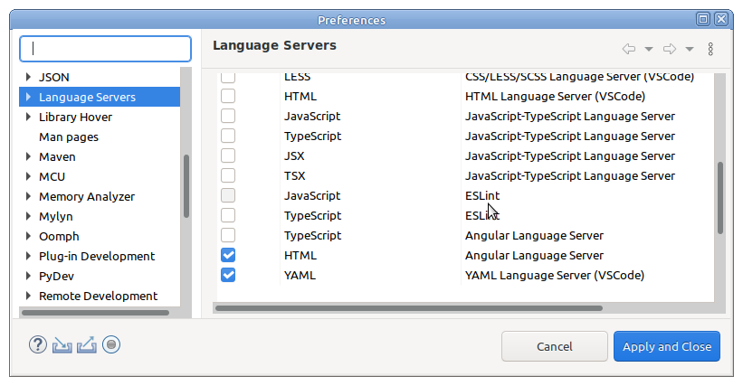

# Internship


## Project structure

```

SERVER - Bundled Tomcat 9 for shared development and final product packaging

src - Sources for the server side java development

webapp - Tomcat content directory for development and final product packaging

UX/react-api-tester - React web frontend application, using vite

Tomcat.launch - Tomcat eclipse launcher for debugging side java or development

libsrc - 3rd party java libraries source code for debugging

Makefile - compile, and build everything, or start local tomcat

'Tomcat -config' - sample eclipse tomcat configuration

local_tomcat.sh - starts local tomcat instance using configuration, and the web application from local_tomcat directory

local_tomcat - configuration to start a local instance of tomcat

```


## To Install  Latest node on ubunty or derivative (e.g. Linux Mint)
```
sudo npm cache clean -f
sudo npm install -g n
sudo n stable
```


## Makefile targets

```
local_ux: 
	1) Runs npm install in UX/react-api-tester, just to make sure vite/npm packages are there
	2) Kills vite server, if running, or whatever is listening on port 5173
	3) Starts vite server with UX/react-api-tester project
	4) Kills all chromium processes, which are started with --disable-web-security  (ref. start_chromium.sh)
	5) Starts a new chromium with disable-web-security, and temp user profile under /tmp
```

```
ux:	
	1) Runs npm install in UX/react-api-tester, just to make sure vite/npm packages are there
	2) Runs npm build in UX/react-api-tester, and copies compiled assets under webapp
```

```
java-compile:
	1) Compiles all java files under src into webapp/WEB-INF/classes directory
	Uses list with java files for compilation
```

```	
war:
	1) Packages fully compiled/assembled java/react application to target/ROOT.war Web-Application  
```

```
local_tomcat:
	1) Kills local tomcat server server, if running, or whatever is listening on port 8000
	2) Starts a new tomcat server process with configuration  from local_tomcat (on port 8000)
	Can be easily modified to turn it into systemd service for the target deployment,
	Or for remote debuging
```

## Java libraries

Java libraries are hand downloaded from maven central to ``webapp/WEB-INF/lib`` directory.
Source jar packages are hand downloaded to ``libsrc`` directory


## Eclipse

### Validation
Turn off the language servers in Window ->  Preferences -> Language Servers. All, but HTML

### Eclipse Web Tools Project (WTP)
Disable TSX validations



